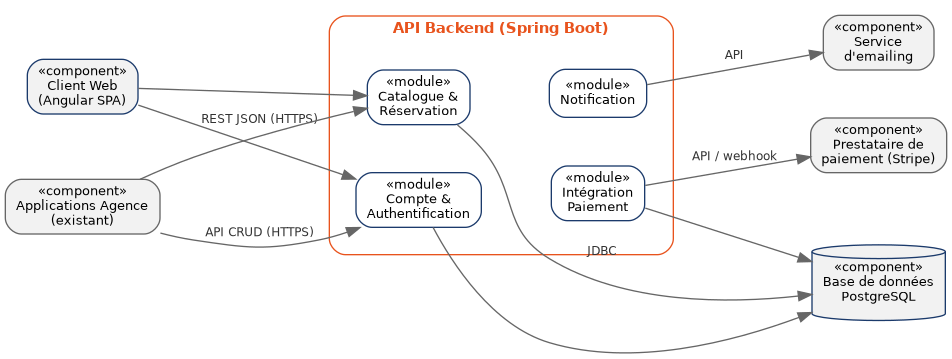
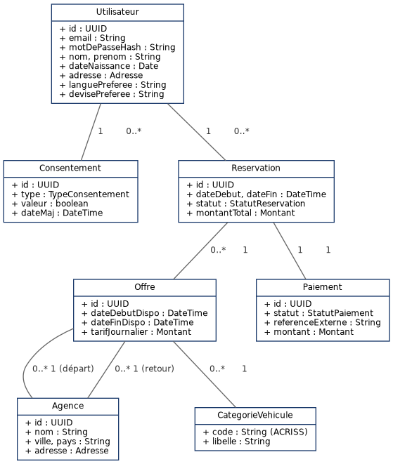
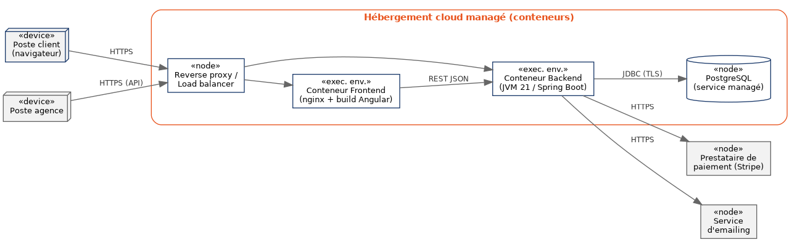

# Résumé technique — architecture cible

> Ce document résume, pour un développeur qui rejoint le projet,
> l'essentiel de la [proposition d'architecture](Proposition_architecture_YourCarYourWay.odt)
> complète. En cas de doute, le document complet fait référence.

## Style architectural

Monolithe modulaire exposant une API REST unique, consommée par le
client web (Angular) et par les applications agence existantes.
Découpage interne en modules par domaine métier (compte, catalogue &
réservation, paiement, notification — modules prévus dans l'architecture
cible, voir diagramme ci-dessous), pour
rester cohérent avec le périmètre du projet sans la complexité
opérationnelle d'une architecture en microservices.



## Stack retenue

| Couche | Choix | Pourquoi (résumé) |
|---|---|---|
| Frontend | Angular | Cohérent avec le socle déjà maîtrisé en interne et avec l'application la plus fiable de l'audit (US) |
| Backend | Java 24 / Spring Boot | Écosystème mature, aligné avec le template interne déjà utilisé sur d'autres projets |
| Base de données | PostgreSQL | Transactions ACID adaptées aux réservations et paiements |
| Authentification | JWT d'accès avec expiration, mots de passe hachés en bcrypt | Implémentation actuelle du PoC ; le refresh token reste à prévoir |
| Paiement | Délégué à un prestataire externe (ex. Stripe) | Aucune donnée bancaire stockée côté Your Car Your Way |
| Conteneurisation | Docker | Reproductibilité des environnements |

Le détail des comparaisons (options écartées et pourquoi) est en
section 8 de la proposition d'architecture complète.

## Modèle de données (vue simplifiée)



## Déploiement



## Comment exécuter ce PoC

La meilleure manière de démarrer la preuve de concept est d'utiliser
Docker Compose depuis la racine du dépôt :

```bash
docker compose up --build
```

Ensuite, ouvrez :

- `http://localhost:4250` pour l'interface Angular
- `http://localhost:8050` pour le backend
- `http://localhost:8050/swagger-ui/index.html` pour l'API docs

Les commandes `make run`, `make test`, `make test-e2e` et `make down` sont
des raccourcis Docker Compose documentés dans le README racine. La stack
expose PostgreSQL sur le port `5532`, le backend sur `8050` et le frontend
sur `4250`.

## Ce que le PoC de ce dépôt valide spécifiquement

Le dépôt implémente actuellement l'authentification, les utilisateurs et le
tchat. Les modules catalogue/réservation, paiement et notification sont des
éléments de l'architecture cible, mais ne sont pas livrés par ce PoC.

Le PoC porte uniquement sur la fonctionnalité de tchat et vise à
vérifier que l'architecture ci-dessus supporte un flux **temps réel**
(WebSocket/STOMP côté backend), en complément des échanges REST
classiques déjà couverts par le reste du cahier des charges. Voir
[`POC_CHAT.md`](POC_CHAT.md) pour le détail du scénario.

Le backend expose l'endpoint SockJS `/ws`, protège la commande STOMP
`/app/chat.send` avec le JWT transmis lors de la connexion, puis diffuse les
messages sur `/topic/conversations/{conversationId}`. L'interface Angular
utilise le même jeton pour ses appels REST et sa connexion STOMP.
